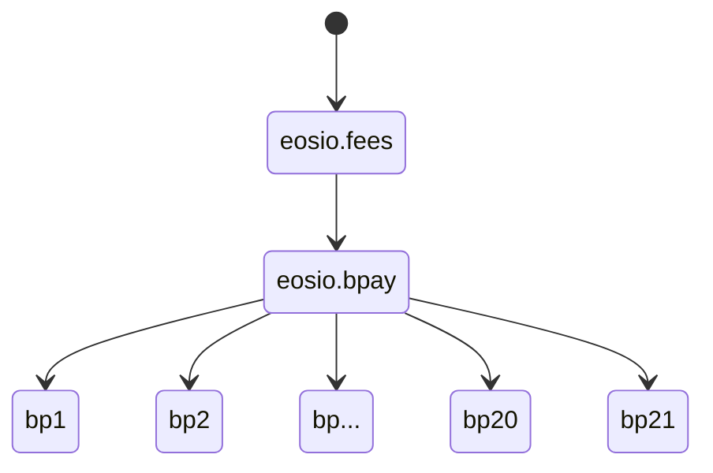

# EOS Block Pay (`eosio.bpay`) [](https://github.com/eosnetworkfoundation/eosio.bpay/actions/workflows/test.yml)

## Overview

The `eosio.bpay` contract handles system block pay distribution earned by fees.



## Development and Testing

### Build Instructions

To compile the contract, developers can use the following command:

```sh
$ cdt-cpp eosio.bpay.cpp -I ./include
```

### Testing Framework

The contract includes a comprehensive testing suite designed to validate its functionality. The tests are executed using the following commands:

```sh
$ npm test

> test
> bun test
```
